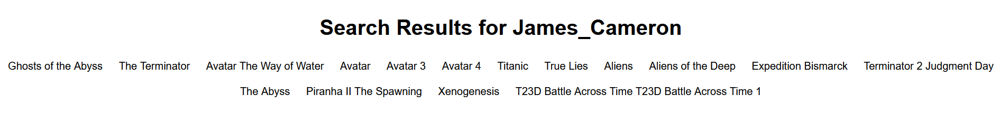
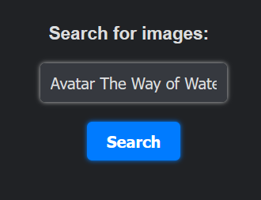
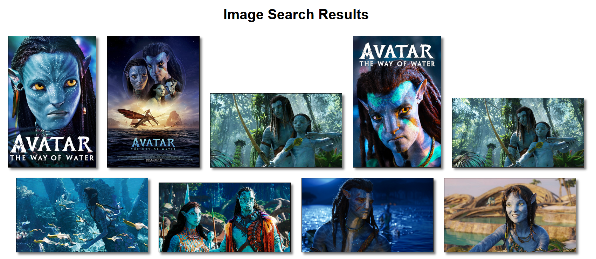

- --
- --
# Movie and Image Search
- --
- --
This is a web application built using Flask that allows users to search for movies directed by a specific director and images related to a search query.
- --
- --
# Prerequisites
Before running this application, you must have the following installed:

* Python 3
* Flask
* The Movie Database API (TMDB) key
* Google Custom Search Engine (CSE) key and search engine ID
- --
- --
# Installation
1. Clone this repository to your local machine.
2. Create a virtual environment using virtualenv venv. 
3. Activate the virtual environment using source venv/bin/activate (Unix) or venv\Scripts\activate (Windows). 
4. Install the dependencies using pip install -r requirements.txt. 
5. Set the following environment variables:
* FLASK_APP=app.py 
* FLASK_ENV=development 
* TMDB_API_KEY=your_tmdb_api_key_here 
* GOOGLE_API_KEY=your_google_api_key_here 
* GOOGLE_CSE_ID=your_google_cse_id_here
6. Run the application using flask run.
- --
- --
# Usage
Navigate to http://localhost:5000 in your web browser.
- Enter a director's name and click the **"Search"** button to search for movies directed by that person.
- Enter a search query and click the **"Search"** button to search for images related to that query.
- --
- --
# Contributing

Pull requests are welcome. For major changes, please open an issue first to discuss what you would like to change.
- --
- --
# License
This project is licensed under the MIT License - see the LICENSE file for details.
- ---
- --
# How to USE

- On running **dbpedia.py** you should see this main window :

- The top search bar is an end point for director name
- The bottom search bar is an end point for Image Description
- --
### search directors
- --

- type in the name of the director to search for his/her films
- the result will look like this.

- ---
### search Images

- Here, I searched for **Avatar The Way of Water**
- I would get results on the next page as

- ---
-- ---

